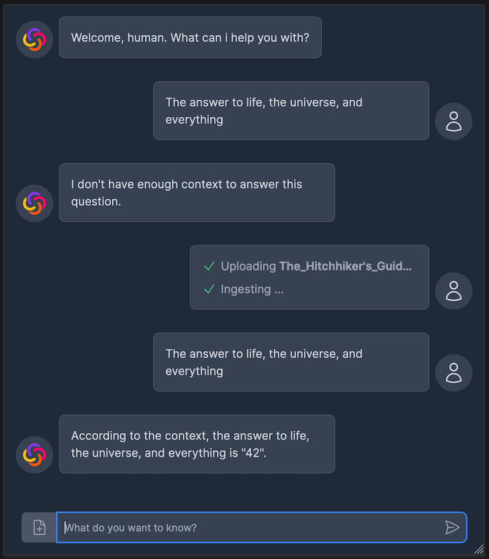

# flowtastic retrieval implementation sample

This is a quick sample app, showcasing a chat/retrieval implementation.

## Setup

1. clone this repository and run `yarn install`
2. copy `.env.example` to `.env` and add the necessary workflow ids
3. run `yarn dev` to launch a local dev server

**Note**: this app works with the sample `Retrieval: Upload` and `Retrieval: Query` templates. If you use other workflows you might have to adjust input/output names to match those from these workflows.
